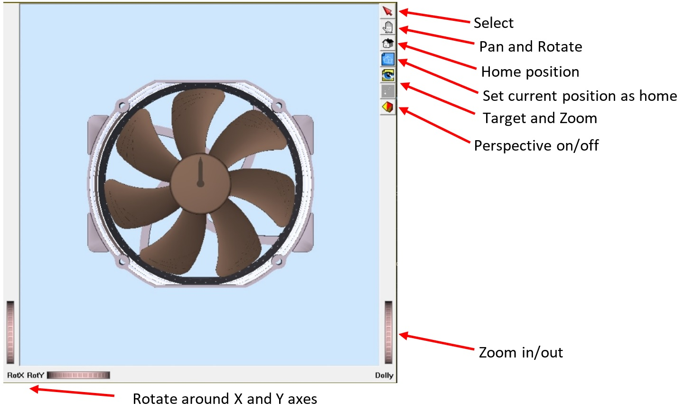

# fan-animation     

Interactive animation of a PC cooling fan using Coin3D (easy-to-use OpenInventor Library based on OpenGL), very useful and constructive for beginners in computer graphics or amateurs who are not planning to use OpenGL professionally. OpenInventor provides a very simple and easy-to-code API useful for many elementary and advanced computer graphics projects.

Written in modern C++ in Visual Studio 2019 Environment, and compatible only with 64-bit Windows, this project interactively animates a PC cooling fan. 

## 1- Pre-requisites

Pre-requisites for being able to run this project are as follows:

### 	A- Coin3D Library

This project requires Coin3D version 4 in order to work properly. In [section 3](#3--introduction-to-coin3d) you will find an introduction to Coin3D and how to install it. Coin3D is an OpenInventor library, and that in turn is an OpenGL API that is easy to work with, especially for beginners in computer graphics or amateurs who are not planning to do anything professional with OpenGL.

### 	B- 64-bit Windows Platform

Unfortunately the current version of this repository only works with 64-bit builds in windows. Current versions of Coin3D are not very compatible with 32-bit windows or 32-bit builds for some reason.

### 	C- (Optional) Microsoft Visual Studio v2014 and beyond

Albeit not strictly a "requirement", since this project was written in Visual Studio v2019 environment, it is easier to work with using Visual Studio 2014 and beyond. If you are using Windows or Mac for C++, there is a good chance some version of Visual Studio is already installed on your PC. Otherwise, click **[here](https://visualstudio.microsoft.com/)** to install the latest Visual Studio on your Windows or Mac.

If you do not have and are not interested in using Visual Studio, you will have to manually configure project properties. See [**here**](https://github.com/pniaz20/inventor-utils) for a guide on how to configure project properties so as to work with Coin3D on your computer.

## 2- Operation and Interaction

1. Open `fan-animate.sln` if you are working with Visual Studio. Otherwise, open the `fan-animate.cpp` source file, the only source file in this project.

2. Run the program in 64-bit (x64) debug build, not release.

3. When the console appears, check the messages in there and make sure the `.wrl` files (VRML graphics file to be imported) have been properly imported. See **here** for an introduction into VRML and its compatibility with OpenInventor.

4. Wait for a few seconds and inside the console press Enter.

5. The scene viewer should open as follows:

   

   

6. Click on the 'select' icon:

   

   

7. Click anywhere on the brown-colored fan blade to select it. You might receive a feedback on the console as well.
8. Press one of the arrow keys to interact with the fan blade in the following manners:
   - **UP-ARROW**: This button turns the fan counterclockwise if stationary, increases the fan turn speed in 10 RPM increments by default, when turning counterclockwise. It decreases the fan speed in 10 RPM increments by default when the fan is rotating clockwise. In other words, this button causes the fan to turn more clockwise. In technical terms, this button increments fan speed by +10 RPM in right-handed coordinates.
   - **DOWN-ARROW**: This button turns the fan clockwise if stationary, increases fan speed by 10 RPM by default in clockwise direction, and decreases fan speed by 10 RPM by default in counterclockwise direction. That is, this button causes the fan to turn more clockwise each time it is pressed. In technical terms, this button increments fan speed by -10 RPM in right-handed coordinates.
   - **LEFT-ARROW**: This is the STOP button. That is, it stops the fan normally, without cutting the animation. The fan would come to a normal stop, regardless of its speed and direction.
   - **RIGHT-ARROW**: This is the KILLSWITCH button. This button immediately cuts off the animation and resets the fan to its original orientation.
9. Gaze at the wonder and beauty of what you can see. Don't be shy, interact with the fan.
10. Close the scene viewer. At this moment the program will write the object with its current configuration into a `.iv` file, the default file format of Coin3D.

the program uses a slow acceleration for up and down arrows, and a fast deceleration rate when the left-button is pressed. These rates, as well as velocities and their increments can easily be modified in the source code, because they are all global variables.

You may realize that true RPMs are not exactly equal to real RPM values you can measure visually, and that is because I was using the timer engine instead of the animation engine for animating the object.

## 3- Introduction to Coin3D

Coin3D is an OpenInventor library for easily coding and generating computer graphics objects. It is much simpler to use than other OpenGL libraries and APIs, and is most useful for educational purposes, and for people who are not professional graphic designers, and want to build relatively simple graphics models in C++.

Coin3D is currently being held and maintained in [**this repository**](https://github.com/coin3d).

Even though the GitHub page of the repository includes [**instructions on how to install Coin3D on Windows, Mac and Linux**](https://github.com/coin3d/coin/wiki/BuildWithCMake), the installation instructions are somewhat confusing to follow. They also include installing Boost and CMake manually, none of which are necessary in fact. You would also have to install Coin and SoWin separately and build them separately. The present repository was written in Windows, and Coin3D library for windows appears to only support 64-bit builds as it turns out.

[**This GitHub repository of mine**](https://github.com/pniaz20/inventor-utils) includes the required Coin3D directory for **Windows**, as well as guidance and documentation on how to easily install and use Coin3D. It also has a sample code for testing if Coin3D is working properly in Windows.

If you want a very simple instruction set for installing Coin3D, simply follow the instructions on **[my repository](https://github.com/pniaz20/inventor-utils)**.

## 4- License

This repository is MIT license, but OpenInventor and Coin3D have different licenses. Therefore, no matter where you get Coin3D from, its own repository or my repository, make sure you adhere to its terms of use.